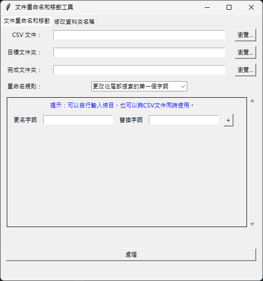
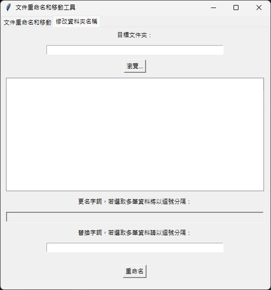

# Batch File Folder Renamer 
 
A tool for batch renaming files and folders based on specified rules. 
 
## Features 
 
- Batch rename files based on rules specified in a CSV file. 
- Manually input rename rules through the user interface. 
- Check for duplicate rename entries and provide warnings. 
- Move files to a specified Export Folder after renaming. (Contains folder structure)
- Handle folder renaming with user-specified rules. 
 
## Installation 
 
1. Clone the repository: 
 
   ```sh 
   git clone https://github.com/xxeye/Batch_File_Folder_Renamer.git 
   ``` 
   
   Run the executable file or install Python and the required dependencies, and run the script。
 
2. Navigate to the project directory: 
 
   ```sh 
   cd Batch_File_Folder_Renamer 
   ``` 
 
3. Install the required dependencies: 
 
   ```sh 
   pip install -r requirements.txt 
   ``` 
 
## Usage 
 
1. Run the application: 
   - Please back up the original data before running.
   ```sh 
   python BatchFileRenamer_CSV.py 
   ``` 
 
2. Use the graphical user interface to: 
   - Select a CSV file containing rename rules. 
   - Specify the target folder containing files to be renamed. 
   - Specify the complete folder where renamed files will be moved. 
   - Manually add rename rules if needed. 
   - Process the files based on the specified rules. 
 
## CSV File Format 
 
The CSV file should have two columns: 
1. Old name (required) 
2. New name (optional) 
 
Example: 
 
```csv
old_name1,new_name1
old_name2,new_name2
old_name3,
```
 
- If the new name is empty, the file will only be moved to the new folder without renaming. 
 
## Screenshots 
 
 

1. **文件重命名和移動工具**: File Renaming and Moving Tool
2. **文件重命名和移動**: File Renaming and Moving
3. **修改資料夾名稱**: Rename Folder
4. **CSV 文件**: CSV File
5. **目標文件夾**: Target Folder
6. **完成文件夾**: Export Folder
7. **重命名規則**: Renaming Rule
8. **更改從尾部搜索的第一個字詞**: Replace the first occurrence from the end
9. **提示：可以自行輸入條目，也可以與 CSV 文件同時使用。**: Note: You can enter items manually, or use them with the CSV file simultaneously.
10. **更名字詞**: Old Name
11. **替換字詞**: New Name
12. **處理**: Process

 

1. **文件重命名和移動工具**: File Renaming and Moving Tool
2. **文件重命名和移動**: File Renaming and Moving
3. **修改資料夾名稱**: Rename Folder
4. **目標文件夾**: Target Folder
5. **瀏覽**: Browse
6. **更名字詞，若選取多筆資料將以逗號分隔**: Old Name, separate multiple items with commas
7. **替換字詞，若選取多筆資料請以逗號分隔**: New Name, separate multiple items with commas
8. **重命名**: Rename
 
## License 
 
This project is licensed under the MIT License. See the [LICENSE](LICENSE) file for details. 
 
## Contributing 
 
Contributions are welcome! Please feel free to submit a Pull Request. 
